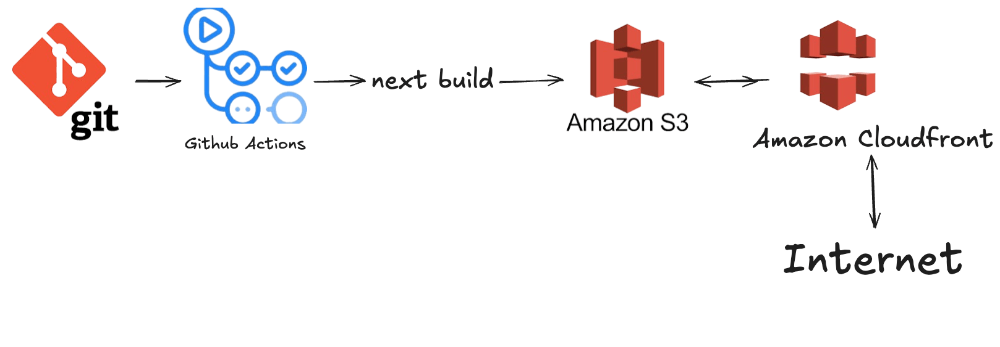

# 프론트엔드 배포 파이프라인

이 프로젝트는 GitHub Actions를 통한 자동화된 CI/CD 파이프라인을 구현하여 AWS S3와 CloudFront를 활용한 정적 웹 호스팅을 제공합니다.

## 배포 프로세스

1. **Git & GitHub**

   - main 브랜치에 merge를 하면 Github actions가 동작하여 배포를 시작합니다.

2. **GitHub Actions**

   - `.github/workflows/deployment.yml`에서 작성한 yml의 설정에 따라 다음과 같은 작업을 수행합니다.:
     - 코드 체크아웃
     - 의존성 설치
       - 프로젝트에 필요한 라이브러리를 설치
     - Next.js 프로젝트 빌드
       - build를 통해 out 생성
     - AWS를 통해 배포
       - AWS ACCESS_KEY, AWS SECRET_ACCESS_KEY를 통해 AWS CREDENTIALS에 인증

3. **AWS S3**

   - 빌드된 결과물을 S3와 동기화합니다.
   - (--delete)를 통해 로컬에 없는 파일은 S3에도 없도록 동기화합니다.

4. **Amazon CloudFront**
   - CloudFront를 통해 전세계 사용자들에게 콘텐츠가 빠르게 전달됩니다.
   - Cloudfront의 캐시를 무효화시켜 항상 최신버젼의 웹사이트가 되도록 설정
   - 엣지 로케이션이라고 하는 캐시 서버를 통해 각 지역 사용자에 맞게 콘텐츠 전달 가능 (Cloudfront는 전 세계 450개 이상의 캐시 서버가 있다고 하네요.)

## 주요 링크

- S3 버킷 웹사이트 엔드포인트: [s3 url](http://minseok-hp.s3-website.ap-northeast-2.amazonaws.com/)
- CloudFrount 배포 도메인 이름: [cloudfront 주소](https://d33ea8ashsmooa.cloudfront.net)

## 주요 개념

- GitHub Actions과 CI/CD 도구:

  - "CI/CD가 무엇인가요?"
    → CI는 코드 변경사항을 자주 병합하고 테스트하는 과정이고, CD는 이를 자동으로 배포하는 과정입니다.
    → GitHub Actions는 이런 과정을 자동화해주는 도구로, main 브랜치에 코드가 병합되면 자동으로 배포가 시작됩니다.

- S3와 스토리지:

  - "S3가 무엇이고 어떤 특징이 있나요?"

    1. 객체 스토리지의 개념

       - 파일을 객체(Object) 형태로 저장하는 저장소입니다.
       - 각 객체는 고유한 URL을 가지며, HTTP/HTTPS를 통해 접근 가능합니다.
       - 버킷(Bucket)이라는 최상위 디렉토리 개념으로 데이터를 구성합니다.

    2. 주요 특징

       - 무제한 용량: 저장 용량의 제한이 없습니다.
       - 정적 웹 호스팅: HTML, CSS, JavaScript 파일을 호스팅할 수 있습니다.

- CloudFront와 CDN:

  - "CDN이 무엇이고 어떻게 동작하나요?"

    1. 기본 개념

       - 지리적으로 분산된 서버 네트워크입니다.
       - 사용자와 가까운 서버(엣지 로케이션)에서 콘텐츠를 제공합니다.
       - 원본 서버의 부하를 줄이고 사용자에게 빠른 응답을 제공합니다.

    2. 동작 방식
       1. 첫 요청: 사용자가 콘텐츠를 요청하면 가장 가까운 엣지 서버가 응답합니다.
       2. 캐싱: 엣지 서버에 콘텐츠가 없다면 원본 서버에서 가져와 캐시합니다.
       3. 후속 요청: 캐시된 콘텐츠를 바로 제공하여 속도가 향상됩니다.

    - "CDN을 사용하는 이유가 무엇인가요?"

      - 전 세계 사용자들에게 빠른 속도로 콘텐츠를 전달할 수 있습니다.
      - CloudFront는 전 세계 450개 이상의 엣지 로케이션을 통해 지연 시간을 최소화합니다.

    - 캐시 무효화(Cache Invalidation):
      - 새로운 버전의 웹사이트를 배포했을 때, 사용자들이 이전 버전을 보지 않도록 하기 위해서입니다.
      - deployment.yml 파일에서 /\*로 설정하여 모든 파일의 캐시를 무효화합니다.
